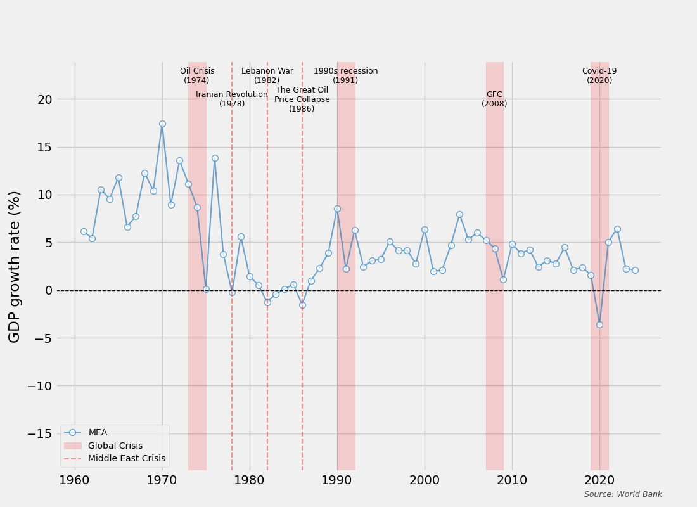

# Business Cycles in the Middle East (MEA)

This project analyzes the historical GDP growth rate of the Middle East and North Africa (MEA) region from 1960 to the present using data from the**  **World Bank API** . It specifically highlights how global economic shocks and regional geopolitical events have impacted the region's economic volatility.

